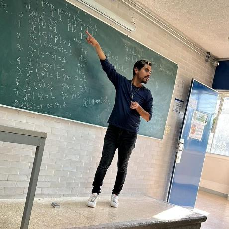

# Manuel Soto Romero 

Updated on: February 7, 2025      
[*Versión en Español*](..)

- Publications
- Teaching
- Professional Experience
- Thesis Topics
- Talks

## 🌿 About Me

I am currently a lecturer at the *Facultad de Ciencias* of the *Universidad Nacional Autónoma de México* (UNAM), where I teach courses related to computational logic, programming language theory, and formal verification. Some of the courses I have taught include Programming Languages, Computational Logic, Compilers, Declarative Programming, and Semantics and Verification.

My academic background includes a Bachelor's degree in Computer Science from UNAM (2019) and a Master’s degree in Computer Science and Engineering from IIMAS at UNAM (2023).

In the professional field, I work as a Data Engineer at Xperbit, where I design and develop ETL processes, interactive dashboards, and machine learning models. I have led the migration of dashboards from Tableau to Plotly Dash and developed an internal Python library to streamline dashboard creation. My experience combines practical data-driven solutions with the development of educational materials and team training.

## 🎯 Areas of Interest

My research interests include computational logic, programming language theory, and their formalization through the Curry-Howard correspondence. I focus on formal verification using proof assistants such as Coq, the development and optimization of SAT-solvers, and exploring the foundations of functional programming. I am also interested in the connection between automated reasoning and machine learning, as well as the role of computational ethics in the responsible development of emerging technologies.

I am keen to collaborate on research projects focused on the implementation and improvement of SAT-solvers, exploring their relationship with automated reasoning and applications in areas such as artificial intelligence and urban mobility.

## 📩 Contact

Manuel Soto Romero   
Correo: [manu@ciencias.unam.mx](manu@ciencias.unam.mx)   
GitHub: [https://github.com/manu-msr/](https://github.com/manu-msr/)   
Blog: [https://medium.com/@lambdaspace](https://medium.com/@lambdaspace)   